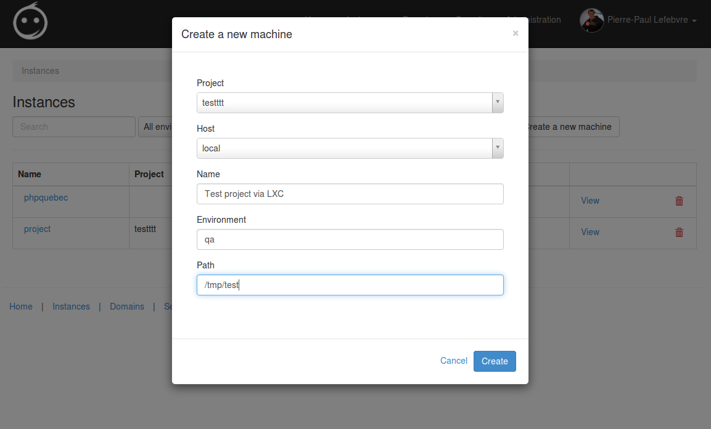

# VagrantControl

This is currently a work in progress. 

VagrantControl is the web interface to a few other API (nginx-api, vagrant-worker and htpasswd-api). 
It lets you add vagrant project and start/stop/provision them on the fly without connecting via SSH.
It also let you use different provider at will. So you can use this to deploy your vagrant project into 
a VMWare cluster (via the free vagrant plugin vagrant-vsphere) or even right into Amazon AWS (via the free plugin
vagrant-aws).

ACL is being done right now, but in the near future it will be able to restrict access to project (a group of vagrant
instances). You will also be able to give permissions on the host level.
Exemple : your team ABC can access project ZXY. Your team also has access to host DEV. Your team don't have access to host
PROD.
So your team ABC can deploy/start/stop/provision the instances in project ZXY on the host DEV but don't have any
rights for the instances linked to the PROD host.

Git and multi-machines are now supported. You can launch a vagrant instance from a project that is linked 
into a git repository. At creation time you can choose which branch/tag you want to use.

Feel free to contact us if you want a little demo around the project.

## License

[Creative Commons Attribution 3.0 Unported] [2]
  [2]: https://raw.github.com/Pheromone/vagrant-control/master/LICENSE.txt

# Note 

Keep in mind that this project is closer to ALPHA than to STABLE. DO NOT use on production system.
