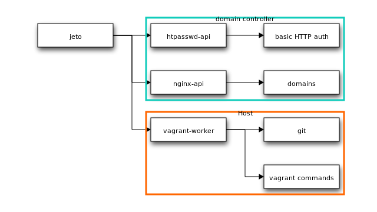

# ĵeto

Why ĵeto ? Because https://translate.google.com/?ie=UTF-8&hl=en&client=tw-ob#eo/en/%C4%B5eto

DOC: http://jeto.readthedocs.org/en/latest/

*This is currently a work in progress* 

ĵeto is the web interface to several APIs (nginx-api, vagrant-worker and htpasswd-api).

With ĵeto you add and manage (start/stop/provision) vagrant projects on the fly without connecting via SSH.

###Providers
Providers like **vagrant-vsphere**, allowing you to deploy your vagrant project into a VMWare cluster;  **pluginvagrant-aws** which deploys your project right onto Amazon AWS or any other can all be used

###ACL

Access Control Management has been implemented. You can restrict access to project (a group of vagrant instances). You can also give access on the host level.

As an example : You will be able to give a group of Developers access to a project. But only the lead developer has PROD access.  

So all developers can deploy/start/stop/provision the DEV environment but only the lead has access to deploy to the PROD environment

###GIT
Git and multi-machines are now supported. You can launch a vagrant instance from a project that is linked 
from a git repository. At creation time you can choose which branch/tag you want to use.

Feel free to contact us if you want a little demo around the project.

###TESTS
To launch test, you need to install virtualenv.

`pip install virtualenv`

Create your venv in the root of the project

`virtualenv venv`

Activate your venv

`. venv/bin/activate`

Reinstall package exclusively in your venv

`pip install -r requirements.txt`

After activation of virtualenv and configure environment, you can launch test with py.test :

`py.test tests/`

###INITIALISE DATABASE

``python initdb.py``

###GIVE ADMIN ROLE TO THE CURRENT USER

``python manage.py add_admin``

## License

[Creative Commons Attribution 3.0 Unported] [2]
  [2]: https://raw.github.com/Pheromone/vagrant-control/master/LICENSE.txt

# Note 

Keep in mind that this project is closer to ALPHA than to STABLE. DO NOT use on production system.
